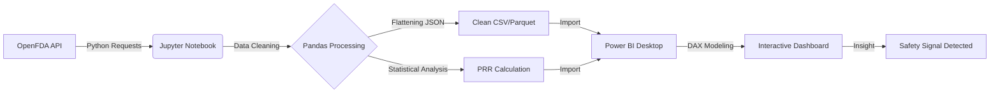

# Project Background

The United States's Food and Drug Administration, established in 1906, is a government body, responsible for promoting and protecting public health through the control and supervision of food safety, pharmaceuticals, consumable products, and animal products. 

The OpenFDA has an API that has significant amounts of data of its recall enforcement reports, adverse events, complete transparency reponse letters, and device sub-categories. Using the OpenFDA API, this project extracts and synthesizes data of adverse event reports, processeing complex JSON data into an analytical format, and calculateing industry-standard metrics PRR to flag potential risks for drug manufacturers and regulatory consultants.

Insights and recommendations are provided on the following key areas:
- **Medical Reaction Analysis**: Evaulation of reaction groups based on the pharmaceutical drug used in the United States, and by PRR score, target counts, and active safety signals. 

## Project Flowchart

An interactive PowerBI Dashboard can be downloaded here [Here](https://github.com/harrold-mussa/pharmaguard-signal-detection/dashboard/screenshots/safety_signals_medical.pdf).

## Data Structure & Initial Checks

## Executive Summary

### Recommendations:
